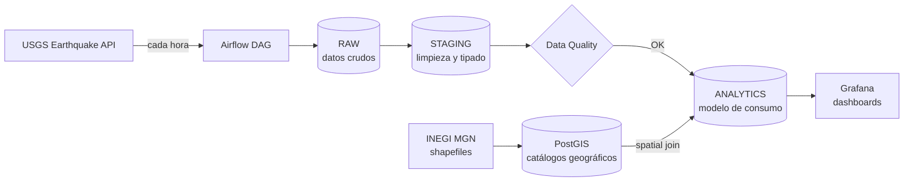

# 🌎 Global Stream Data Platform

Pipeline de datos sísmicos **end-to-end y por hora**, alimentado por la **API de USGS**, con capas **Raw → Staging → Analytics**, controles de calidad de datos, enriquecimiento geoespacial con **INEGI MGN + PostGIS** y monitoreo en tiempo real con **Grafana**.


## 📌 Tabla de contenidos

- [Descripción](#-descripción)
- [Arquitectura](#-arquitectura)
- [Stack tecnológico](#-stack-tecnológico)
- [Estructura del repositorio](#-estructura-del-repositorio)
- [Requisitos previos](#-requisitos-previos)
- [Instalación y puesta en marcha](#-instalación-y-puesta-en-marcha)
- [Servicios y puertos](#-servicios-y-puertos)
- [Capas de datos](#-capas-de-datos)
- [Calidad de datos](#-calidad-de-datos)
- [Enriquecimiento geoespacial](#-enriquecimiento-geoespacial)
- [Monitoreo con Grafana](#-monitoreo-con-grafana)
- [Backfill histórico](#-backfill-histórico)
- [Comandos útiles](#-comandos-útiles)
- [Seguridad](#-seguridad)
- [Roadmap](#-roadmap)
- [Autor](#-autor)


## 📖 Descripción

Esta plataforma ingiere cada hora los eventos sísmicos publicados por el [USGS Earthquake Catalog API](https://earthquake.usgs.gov/fdsnws/event/1/), los procesa a través de tres capas de datos y los enriquece geográficamente para el territorio mexicano usando el **Marco Geoestadístico Nacional (MGN) del INEGI**. El resultado se consulta en dashboards de Grafana casi en tiempo real.

**Objetivos del proyecto**

- Demostrar un pipeline de datos orquestado de punta a punta con buenas prácticas de ingeniería de datos.
- Separar responsabilidades por capas (Raw / Staging / Analytics).
- Validar la calidad de los datos antes de exponerlos para análisis.
- Habilitar análisis espacial con PostGIS (estado, municipio, etc.).
- Contar con observabilidad del negocio (sismos) y del pipeline.


## 🏗️ Arquitectura



El orquestador (**Airflow 3 con CeleryExecutor**) programa y ejecuta las tareas de extracción, transformación, carga y validación. La base de datos de negocio (**PostgreSQL + PostGIS**) es una instancia **independiente** de la base de metadata de Airflow.

---

## 🧰 Stack tecnológico

| Componente | Tecnología | Uso |
|---|---|---|
| Orquestación | Apache Airflow 3 (CeleryExecutor) | Scheduling y ejecución de DAGs |
| Broker | Redis 7.2 | Cola de tareas de Celery |
| Metadata DB | PostgreSQL 16 | Estado interno de Airflow |
| Data DB | PostgreSQL 16 + PostGIS 3.5 | Capas Raw / Staging / Analytics + geodatos |
| Visualización | Grafana | Dashboards y monitoreo |
| Contenedores | Docker + Docker Compose | Entorno reproducible |
| Fuente de datos | USGS Earthquake API | Eventos sísmicos |
| Geografía | INEGI MGN | Límites estatales y municipales |

---

## 📂 Estructura del repositorio

```text
Global-Stream-Data-Platform/
├── dags/                  # DAGs de Airflow
├── docs/                  # Documentación adicional
├── grafana/
│   ├── provisioning/      # Datasources y providers (provisioning automático)
│   └── dashboards/        # Dashboards en JSON
├── requirements/          # Dependencias de Python
├── scripts/               # Scripts auxiliares
├── sql/                   # DDL / DML de las capas y vistas
├── src/                   # Código del pipeline (extract, transform, load, backfill)
├── docker-compose.yaml    # Stack completo
├── .dockerignore
└── .gitignore
```

> `src/` y `sql/` se montan dentro de los contenedores de Airflow, por lo que los DAGs pueden importar código propio con `from src.<modulo> import ...`.

---

## ✅ Requisitos previos

- [Docker](https://docs.docker.com/get-docker/) y [Docker Compose v2](https://docs.docker.com/compose/)
- Git
- Mínimo recomendado: **4 GB de RAM** libres para el stack
- *(Opcional)* Cliente SQL como DBeaver o `psql`

---

## 🚀 Instalación y puesta en marcha

### 1. Clonar el repositorio

```bash
git clone https://github.com/dataengineermx/Global-Stream-Data-Platform.git
cd Global-Stream-Data-Platform
```

### 2. Crear el archivo `.env`

Crea un archivo `.env` en la raíz (**nunca lo subas a Git**):

```env
# --- Airflow ---
AIRFLOW_UID=50000
FERNET_KEY=<genera_una_clave>
AIRFLOW__API_AUTH__JWT_SECRET=<un_secreto_largo_y_aleatorio>
_AIRFLOW_WWW_USER_USERNAME=airflow
_AIRFLOW_WWW_USER_PASSWORD=<tu_password>

# --- Base de datos de negocio (PostGIS) ---
APP_DB_USER=<usuario>
APP_DB_PASSWORD=<password>
APP_DB_NAME=<nombre_bd>
DATA_DB_HOST_PORT=5433

# --- Grafana ---
GRAFANA_ADMIN_USER=admin
GRAFANA_ADMIN_PASSWORD=<password_admin>
GRAFANA_DB_PASSWORD=<password_usuario_lectura_grafana>
```

Para generar una `FERNET_KEY`:

```bash
python -c "from cryptography.fernet import Fernet; print(Fernet.generate_key().decode())"
```

> Si alguna contraseña contiene caracteres especiales (`@ : / #`), debe ir **URL-encoded**, ya que se usa en la cadena de conexión `AIRFLOW_CONN_DATA_DB`.

### 3. Levantar el stack

```bash
docker compose up airflow-init   # solo la primera vez (migraciones + usuario admin)
docker compose up -d
```

### 4. Verificar

```bash
docker compose ps
```

Todos los servicios deben aparecer como `healthy` / `running`.

---

## 🔌 Servicios y puertos

| Servicio | URL / Puerto | Descripción |
|---|---|---|
| Airflow UI / API | http://localhost:8080 | Orquestación y monitoreo de DAGs |
| Grafana | http://localhost:3001 | Dashboards |
| PostGIS (datos) | `localhost:5433` | Base de datos de negocio |
| Postgres (metadata) | interno (5432) | Solo para Airflow |
| Redis | interno (6379) | Broker de Celery |

**Conexión de Airflow a la base de datos de negocio:** connection id `data_db`

```python
from airflow.providers.postgres.hooks.postgres import PostgresHook

hook = PostgresHook(postgres_conn_id="data_db")
```

> Dentro de la red Docker (`airflow-net`) el host es `postgres-data` y el puerto `5432`. Desde tu máquina usa `localhost:5433`.

---

## 🗄️ Capas de datos

| Capa | Propósito |
|---|---|
| **Raw** | Respuesta de la API almacenada tal cual (inmutable, trazable, reprocesable). |
| **Staging** | Datos limpios, tipados y deduplicados; geometrías construidas. |
| **Analytics** | Modelo listo para consumo, enriquecido geográficamente, que alimenta Grafana. |

<!-- TODO: documentar nombres de esquemas/tablas y el diagrama del modelo en docs/ -->

---

## 🧪 Calidad de datos

Antes de promover datos a la capa Analytics se validan reglas como:

- Campos obligatorios no nulos (id del evento, tiempo, coordenadas, magnitud).
- Rangos válidos de latitud / longitud y magnitud.
- Detección de duplicados por identificador de evento.
- Frescura de los datos (la última ingesta no debe exceder el umbral esperado).

<!-- TODO: ajustar esta lista a las validaciones reales implementadas en el código -->

---

## 🗺️ Enriquecimiento geoespacial

Los epicentros se cruzan espacialmente (`ST_Intersects` / `ST_Within`) contra los polígonos del **INEGI MGN** cargados en PostGIS, permitiendo asociar cada sismo con su **entidad federativa** y **municipio** cuando ocurre dentro del territorio nacional.

```sql
-- Ejemplo ilustrativo
SELECT e.event_id, e.magnitude, m.nom_ent, m.nom_mun
FROM   analytics.earthquakes e
JOIN   geo.municipios m
  ON   ST_Within(e.geom, m.geom);
```

<!-- TODO: reemplazar con los nombres reales de tablas/esquemas -->

Fuente: [INEGI – Marco Geoestadístico](https://www.inegi.org.mx/temas/mg/)

---

## 📊 Monitoreo con Grafana

Grafana se aprovisiona automáticamente desde `grafana/provisioning` (datasources) y `grafana/dashboards` (dashboards en JSON), por lo que al iniciar el contenedor todo queda listo sin configuración manual.

Ejemplos de paneles:

- Mapa de sismos recientes
- Sismos por hora / día
- Distribución por magnitud
- Top estados / municipios afectados
- Salud del pipeline (última ejecución, frescura de datos)

<!-- TODO: agregar capturas en docs/img/ y enlazarlas aquí -->
<!--  -->

---

## ⏪ Backfill histórico

El proyecto incluye lógica de **backfill** en `src/` para cargar periodos históricos desde USGS.

<!-- TODO: documentar el comando o DAG de backfill y sus parámetros -->

---

## 🛠️ Comandos útiles

```bash
# Ver logs de un servicio
docker compose logs -f airflow-scheduler

# Reiniciar un servicio
docker compose restart airflow-worker

# Conectarse a la base de datos de negocio
psql -h localhost -p 5433 -U $APP_DB_USER -d $APP_DB_NAME

# Detener todo
docker compose down

# Detener y borrar volúmenes (⚠️ elimina los datos)
docker compose down -v
```

Para conectar otros contenedores a la misma red:

```bash
docker network connect airflow-net <contenedor>
```

---

## 🔐 Seguridad

- Este `docker-compose.yaml` está pensado **solo para desarrollo local**.
- No subas `.env` ni credenciales al repositorio.
- Cambia todas las contraseñas por defecto antes de exponer cualquier servicio.
- Para limitar el acceso a la BD, publica el puerto solo en loopback: `127.0.0.1:5433:5432`.
- Usa un usuario de **solo lectura** para el datasource de Grafana.

---

## 🧭 Roadmap

- [ ] Alertas en Grafana por sismos de magnitud alta
- [ ] Pruebas automatizadas y CI con GitHub Actions
- [ ] Integración de dbt para el modelado de Analytics
- [ ] Despliegue en la nube
- [ ] Más fuentes de datos (p. ej. SSN México)

---

## 👤 Autor: Adrian M. Valentino

**dataengineermx**
GitHub: [adrian.valentino@outlook.com](https://github.com/dataengineermx)

---

## 📄 Licencia

<!-- TODO: elegir una licencia (MIT, Apache-2.0, etc.) y agregar el archivo LICENSE -->
Pendiente de definir.

---

## 🙏 Créditos

- [USGS Earthquake Hazards Program](https://earthquake.usgs.gov/)
- [INEGI – Instituto Nacional de Estadística y Geografía](https://www.inegi.org.mx/)
- [Apache Airflow](https://airflow.apache.org/), [PostGIS](https://postgis.net/), [Grafana](https://grafana.com/)
